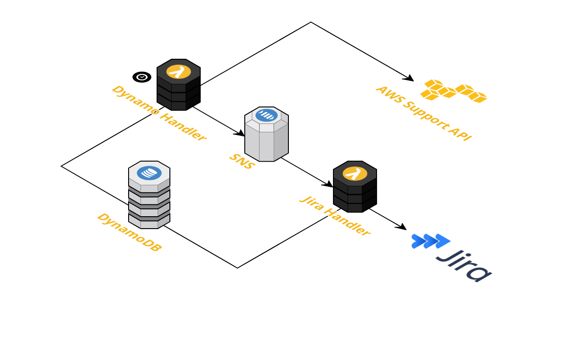

# JustSupport

## Overview

The purpose of this project is to synchronise AWS support cases and Jira tickets. This allows comments and replies in AWS support tickets to appear as comments on Jira tickets and vice versa. 

This is accomplished by using a custom Jira field, when this field contains a valid AWS Support Case number updates to that support case will be posted to the jira's comments automatically. You can have 2 custom fields on a single Jira Ticket, Updating both fields with individual AWS Support References will allow both tickets to post updates onto a single ticket.

By default updates are processed for 4 months, if you complete the AWS Support Ref field after the case was opened all of the previous updates will be added.

After an update is added to an AWS case it will take upto 5 minutes to appear on the Jira ticket. If the update is via an AWS chat session this process will pause and wait for the session to finish before processing the update.

The initial invocation of this feature is done via a 5 minute schedule, after each function completes it publishes an SNS message which invokes the next step until all updates have been processed.

All updates are stored and managed within a Dynamo table, this allows the function to be idempotent and eliminates the risk of duplicates.

We have also implemented the ability to send updates to aws via a jira comment, adding #DearAWS followed by the comment will send the following text in the comment to the corresponding AWS support ticket. once sent the comment will be edited to display #SenttoAWS indicating the message was successfully posted to AWS.

## Getting Started

- **Creating jira field**
    * A custom field (or fields) will need to be created on the Jira project, this field will hold the AWS Support Case Reference.
    * Once these are created their names and IDs should be added into [config.json](config.json) (see below)

- **NodeJs Packages**
    * Run "npm install" in the root folder 

- **[config.json](config.json)**
    * Configure config.json file with your environment-specific information.
    * Most of properties are self-explanatory from their naming convention, but here is a bit more information about some of them:
        * **daysToScan** - Here we set the time period (in days) for which we look back for updates.
        * **iamRolePath** - An IAM role path which will be assumed for your accounts to sync cases from. See below for more information about IAM roles. 
        * **aswIamAccountArns** - Account ARNs which will be queried for AWS tickets (below more info)
        * **jiraAwsFieldName1,2** - Name and ID of the custom jira fields.

- **Serverless**
    * Configure serverless.json:
        * **vpc** - Your VPC settings (if you don't require a VPC - you can remove that section). VPC is needed mostly to access your Jira API.
        * **deploymentBucketName** - S3 bucket name which will be used by serverless framework to deploy the code.
   
    * Run "serverless deploy" in the root directory - this will create CloudFormation stack and roll out all needed AWS resources to the defined AWS account.

- **Required iam role**
    * JustSupport works with one or multiple AWS accounts. In each of them an IAM role should be created and added into config.json.
    * An example of CloudFormation template for this is in [iamRoleCloudformation.template](iamRoleCloudformation.template) file, this details which permisisons are required for this role.
    * If only one IAM Role is to be used simply remove additional roles stated in the [config.json](config.json#L11) file.